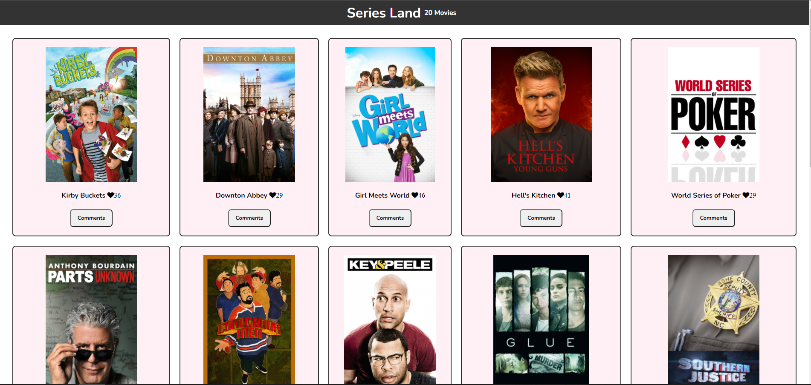

## Series Land



## Live Demo


## Built with

- HTML
- CSS
- JavaScript
- Webpack
- Linters
- API's

## Usage

start by cloning this repository by running:

git clone https://github.com/abdulrahmanshr75/Javascript-Capstone.git

cd into the folder

install all the packages needed by this command :
``````
npm install
``````
you can run this website on live server port 8080 by this command :
```
npm run start
```
to build the project run :
```
npm run build
```
## Authors

👤 Abdulrahman Shrshar
- [Abdulrahman's Github](https://github.com/abdulrahmanshr75)
- [Abdulrahman's Linkedin](https://www.linkedin.com/in/abdulrahman-shrshar-721144161/)

👤 Butler Shimaluwani
- [Butler's Github](https://github.com/butlermuwo)
- [Butler's Twitter](https://twitter.com/ButlerMuwo)
- [Butler's Linkedin](https://www.linkedin.com/in/butler-shimaluwani-41a680159/)


## Show your support

Give a ⭐️ if you like this project!
